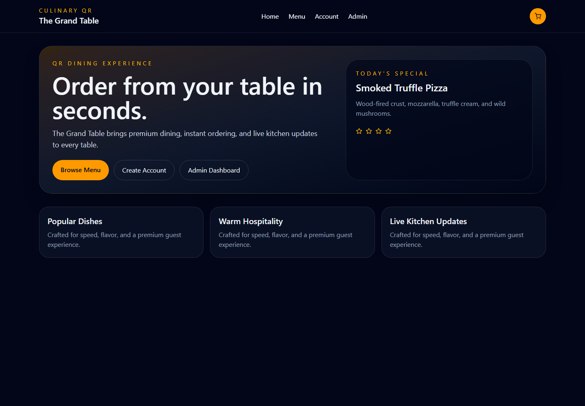

# 🍽️ RestroOrder — Restaurant QR Ordering System

A production-style **MERN stack** restaurant ordering platform with a customer-facing QR ordering experience and a real-time admin dashboard.

**Live demo** → [restro-order-new.vercel.app](https://restro-order-new.vercel.app/)

<p align="center"></p>

## ✨ Features

- **QR table-based ordering flow** — customers scan a table QR to browse the menu and order
- **Menu browsing & cart management** — category-based menu, cart with quantity controls
- **Real-time order updates** — Socket.IO pushes new orders and status changes to the admin dashboard
- **Admin dashboard** — role-based admin login, live order feed, and order status management
- **Coupons** — coupon support at checkout
- **Secure API** — JWT auth, helmet security headers, rate limiting, CORS allow-listing

## 🧰 Tech Stack

| Layer | Tech |
|-------|------|
| Frontend | React 19, Vite, Tailwind CSS, React Router, Framer Motion, Socket.IO client, Axios |
| Backend | Node.js, Express, MongoDB, Mongoose, JWT, bcrypt, Socket.IO, helmet, express-rate-limit |
| Deployment | Frontend → Vercel · Backend → Render · Database → MongoDB Atlas |

## 🚀 Getting Started

```bash
# 1. Install dependencies for backend and frontend
cd backend && npm install
cd ../frontend && npm install

# 2. Backend — configure environment and start
cd backend
# create backend/.env with MONGO_URI, JWT_SECRET, CLIENT_URL, ADMIN_EMAIL, ADMIN_PASSWORD
npm run dev            # http://localhost:5000

# 3. Frontend — start in a second terminal
cd frontend
npm run dev            # http://localhost:5173
```

> On first run, the backend seeds a starter menu and creates the admin user from your env vars.

### Production build

```bash
cd frontend && npm run build && npm run preview
```

## 🔐 Environment Variables (backend)

| Variable | Description |
|----------|-------------|
| `MONGO_URI` | MongoDB connection string |
| `JWT_SECRET` | Secret used to sign JWTs |
| `CLIENT_URL` | Frontend origin (no trailing slash) |
| `ADMIN_EMAIL` | Email for the seeded admin account |
| `ADMIN_PASSWORD` | Password for the seeded admin account |
| `PORT` | Server port (default `5000`) |

## 🔌 API Overview

| Method | Endpoint | Access |
|--------|----------|--------|
| POST | `/api/auth/signup` | Public |
| POST | `/api/auth/login` | Public |
| GET | `/api/foods` | Public |
| GET | `/api/tables` | Public |
| GET | `/api/coupons` | Public |
| POST/PUT/DELETE | `/api/foods` `/api/foods/:id` | Admin |
| POST/PUT/DELETE | `/api/tables` `/api/tables/:id` | Admin |
| POST/PUT/DELETE | `/api/coupons` `/api/coupons/:id` | Admin |
| POST | `/api/orders` | Public |
| GET | `/api/orders` `/api/orders/:id` | Admin |
| PATCH/DELETE | `/api/orders/:id` | Admin |

## 🌍 Deployment

- **Frontend:** Vercel — set `VITE_API_URL` env var to the backend base URL.
- **Backend:** Render — set `MONGO_URI`, `JWT_SECRET`, `CLIENT_URL`, `ADMIN_EMAIL`, `ADMIN_PASSWORD`.
- **Database:** MongoDB Atlas.

## 🗺️ Roadmap

- Payment gateway integration
- Kitchen display screen
- Table availability live view and reservation flow
- Order history for customers

## 📬 Contact

Built by [Ankit Jha](https://ankit-portfolio-puce.vercel.app/) · [LinkedIn](https://www.linkedin.com/in/ankitjhaa/)